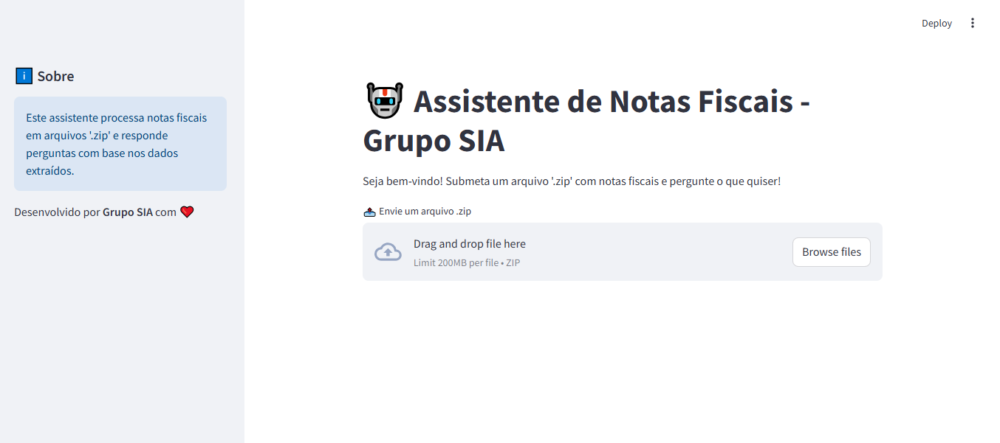

# Desafio 18-06-2025

Grupo SIA (Soluções Inteligentes Autônomas)

## Take-home Assignment

- [Introduction](#introduction)
- [How to configure the application?](#how-to-configure-the-application)
- [How to run the application?](#how-to-run-the-application)
- [How to use the application?](#how-to-use-the-application)

## Introduction

This challenge consists in an application that serves as an AI agent with the purpose of processing invoices sent by the user and answer user queries about them. The application was developed using [**Python**](https://www.python.org/) with [**Streamlit**](https://github.com/streamlit/streamlit) and [**CrewAI**](https://github.com/crewAIInc/crewAI) frameworks and can be executed in a [**Docker**](https://www.docker.com/) container.

## How to configure the application?

The application must be configured using a Gemini API key.

To do that, follow the step below:

1. Configure .env file:

First of all, rename the **.env.example** file to **.env** file and assign the Gemini API key to the associated environment variables named GEMINI_API_KEY.

2. Configure .streamlit/secrets.toml file:

After that, rename the **.streamlit/secrets.toml.example** file to **.streamlit/secrets.toml** file and assign the Gemini API key to the associated environment variables named GEMINI_API_KEY.

## How to run the application?

The application can be executed using a Docker container with i) Makefile file commands or ii) a docker-compose.yml file.

1. Run using Makefile file

A **Makefile** file was created as a single entry point containing a set of instructions to run the application using Docker containers via commands in the terminal.

To run the application, execute the commands:

1. Create a container image from a Dockerfile and a build context:

```
make build-container
```

2.  Create and start a new Docker container from previous image:

```
make startup-container
```

To finish the applications, execute the command:

```
make shutdown-container
```

2.  Run using docker-compose.yml file

A **docker-compose.yml** file was created to run the application as an alternative to using the Makefile file.

To run the application, execute the command:

```
docker-compose up --build -d streamlit-app
```

To finish the applications, execute the command:

```
docker-compose down -v --rmi local streamlit-app
```

## How to use the application?

After running the application successfully, open the browser and access the URL: http://localhost:8501/. Wait for a minute and then a screen with the following image should be displayed:



Then, submit a zip file with invoices to the application by clicking on the 'Browse files' button.

After that, ask a question and click on the 'Enter' button.

Wait for the processing and check the answer.

If you want to ask a new question, just write it in the text box and click on the 'Enter' button again.
