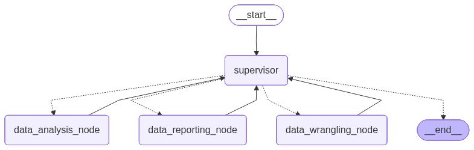

# desafio-2025-09-18

- [Introdução](#introdução)
- [Como configurar a aplicação?](#como-configurar-a-aplicação)
- [Como executar a aplicação?](#como-executar-a-aplicação)
- [Resultados Alcançados](#resultados-alcançados)

## Introdução

Este desafio consiste no desenvolvimento de uma aplicação para automação da compra de VR/VA.

A aplicação foi desenvolvida com base em múltiplos agentes de IA utilizando [**Python**](https://www.python.org/) e [**LangGraph**](https://www.langchain.com/langgraph).

A seguir, é apresentado o fluxo de trabalho da aplicação indicando que existe um Agente Supervisor (`supervisor`) e três nós de agentes especializados que trabalham em conjunto para o processamento de dados e geração de planilhas nos formatos CSV e XLSX:

1. O nó de manipulação de dados (`data_wrangling_node`)
2. O nó de análise de dados (`data_analysis_node`)
3. O nó de reporte de dados (`data_reporting_node`)



## Como configurar a aplicação?

A aplicação deve ser configurada usando uma chave de API OpenAI ou uma chave de API Gemini.

### Configurar o arquivo .env:

Renomeie o arquivo **.env.example** para **.env** e atribua valores para as chaves do arquivo.

Por exemplo:

```
AI_LLM_PROVIDER=openai
AI_LLM_MODEL=gpt-4.1-nano
AI_LLM_TEMPERATURE=0.1
AI_LLM_API_KEY=
```

## Como executar a aplicação?

A aplicação pode ser executada usando comandos adicionados em um arquivo Makefile.

### Arquivo Makefile

Um arquivo **Makefile** foi criado como um único ponto de entrada contendo um conjunto de instruções para o desenvolvimento da aplicação.

Para executar a aplicação, execute o comando:

```
make run-app
```

## Resultados Alcançados:

| Nº  | Item                            | Valor           |
| --- | ------------------------------- | --------------- |
| 1   | Total de funcionários elegíveis | 1771            |
| 2   | Valor total dos vale-refeição   | R$ 1.337.007,50 |
| 3   | Custo total para a empresa      | R$ 1.069.606,00 |
| 4   | Desconto dos funcionários       | R$ 267.401,50   |
