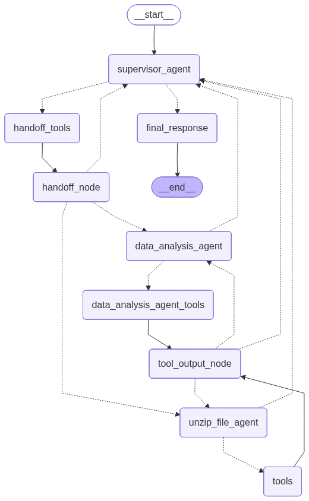

# desafio-2025-10-08

- [Introdução](#introdução)
- [Fluxo de Trabalho](#fluxo-de-trabalho)
- [Como configurar a aplicação?](#como-configurar-a-aplicação)
- [Como executar a aplicação?](#como-executar-a-aplicação)

## Introdução

Este desafio consiste no desenvolvimento de um aplicativo que permite realizar análise exploratória de dados utilizando um arquivo CSV.

## Fluxo de Trabalho

A aplicação foi desenvolvida com base em um fluxo de trabalho envolvendo múltiplos agentes de IA, utilizando as seguintes ferramentas: [**Python**](https://www.python.org/), os frameworks [**Streamlit**](https://streamlit.io/) e [**LangGraph**](https://www.langchain.com/langgraph) e o banco de dados
[**PostgreSQL**](https://www.postgresql.org/)

O fluxo de trabalho da aplicação consiste na utilização de um Agente Supervisor (`supervisor_agent`) e dois agentes especializados - o agente de pré processamento (`unzip_file_agent`) e o agente de análise e plotagem de dados (`data_analysis_node`) - que trabalham em conjunto para o processamento de dados e geração de respostas às perguntas de usuário:



## Como configurar a aplicação?

Antes de executar a aplicação localmente, é necessário instalar o [**Docker**](https://www.docker.com/) na máquina local.

Depois disso, obtenha uma chave de API OpenAI para a configuração dos Agentes de IA.

### Configurar o arquivo .env:

Renomeie o arquivo **.env.example** para **.env** e atribua valores para as chaves do arquivo conforme desejado.

Neste caso, apenas a variável relacionada a API KEY do LLM logo abaixo do comentário AI Settings é necessária. Todas as demais variáveis de ambiente podem ser mantidas sem qualquer alteração.

Por exemplo:

```
AI_LLM_API_KEY=
```

## Como executar a aplicação?

A aplicação pode ser executada usando comandos adicionados em um arquivo Makefile.

### Arquivo Makefile

Um arquivo **Makefile** foi criado como um único ponto de entrada contendo um conjunto de instruções para o desenvolvimento da aplicação.

Construção da Imagem do Contêiner do Banco de Dados

Navegue até a pasta da aplicação onde se encontra o arquivo Makefile e, ao mesmo tempo, o arquivo docker-compose.yml. Então, execute o comando de construção da imagem:

```
make startup-postgresql-container
```

Construção da Imagem do Contêiner da Aplicação

Também navegue até a pasta da aplicação onde se encontram os arquivos anteriores e execute o comando de construção da imagem:

```
make startup-streamlit-app-container
```
