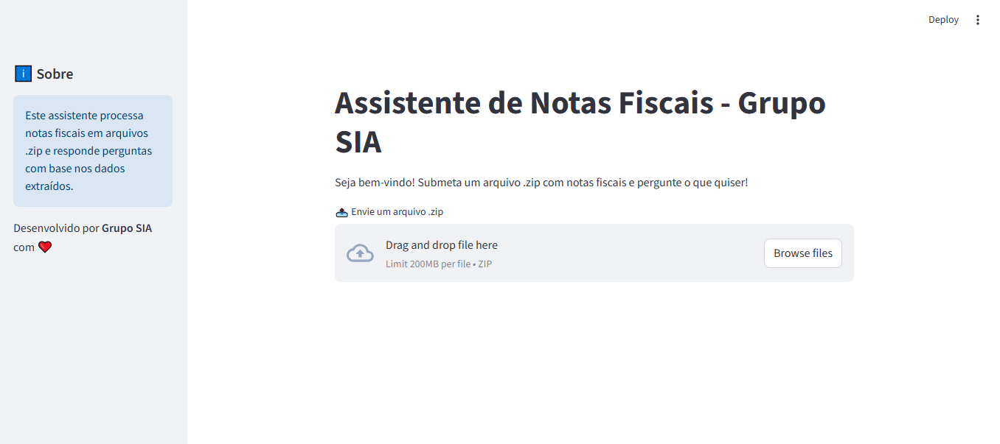

# Desafio 24-06-2025

- [Introdução](#introdução)
- [Como configurar a aplicação?](#como-configurar-a-aplicação)
- [Como executar a aplicação?](#como-executar-a-aplicação)
- [Como usar a aplicação?](#como-usar-a-aplicação)
- [Implantação](#implantação)

## Introdução

Este desafio consiste no desenvolvimento de uma aplicação que serve como um Assistente de Notas Fiscais com o objetivo de processar Notas Fiscais enviadas pelo usuário e responder às suas perguntas sobre elas.

O Assistente de Notas Fiscais foi desenvolvido em [**Python**](https://www.python.org/) com os frameworks [**Streamlit**](https://github.com/streamlit/streamlit) e [**CrewAI**](https://github.com/crewAIInc/crewAI) e pode ser executado em um contêiner [**Docker**](https://www.docker.com/).

## Como configurar a aplicação?

A aplicação deve ser configurado usando uma chave de API OpenAI ou uma chave de API Gemini.

Para isso, siga os passos abaixo:

1. Configurar o arquivo .env:

Primeiramente, renomeie o arquivo **.env.example** para **.env** e atribua os seguintes valores as chaves do arquivo:

1.1 LLM

Defina qual é a LLM utilizada através da variável de ambiente LLM. A LLM poderá ser gpt ou gemini.

1.2 Chave de API

Defina qual é a chave de API utilizada através das variáveis de ambiente OPENAI_API_KEY ou GEMINI_API_KEY. A chave escolhida é dependente da LLM indicada anteriormente. (Caso utilize a chave da OpenAI, o modelo utilizado pelos agentes de IA será o gpt-4.1-mini. Com a chave do Gemini, o modelo será gemini/gemini-2.0-flash.)

1.3 Diretório de arquivos zip

Defina o diretório onde os arquivos zip serão armazenados através da variável de ambiente DATA_DIR.

Por exemplo:

```
LLM=gpt
OPENAI_API_KEY=abcde12345...
GEMINI_API_KEY=your_gemini_api_key
DATA_DIR=data
```

2. Configurar o arquivo .streamlit/secrets.toml:

Em seguida, renomeie o arquivo **.streamlit/secrets.toml.example** para **.streamlit/secrets.toml** e atribua as mesmas variáveis de ambiente e valores definidos no arquivo **.env** anteriormente.

## Como executar a aplicação?

A aplicação pode ser executado usando um contêiner Docker com i) comandos adicionados em um arquivo Makefile ou ii) comandos baseados em um arquivo docker-compose.yml.

1. Arquivo Makefile

Um arquivo **Makefile** foi criado como um único ponto de entrada contendo um conjunto de instruções para executar a aplicação usando contêineres Docker por meio de comandos no terminal.

Para executar e finalizar a aplicação, execute os comandos:

1.1 Para criar uma imagem de contêiner a partir de um Dockerfile e um contexto de compilação:

```
make build-container
```

1.2 Para criar e iniciar um novo contêiner Docker a partir da imagem anterior:

```
make startup-container
```

1.3 Para finalizar a aplicação:

```
make shutdown-container
```

2. Arquivo docker-compose.yml

Um arquivo **docker-compose.yml** foi criado para executar a aplicação como alternativa ao uso do arquivo Makefile.

2.1 Para construir e executar a aplicação:

```
docker-compose up --build -d streamlit-app
```

2.2 Para finalizar a aplicação:

```
docker-compose down -v --rmi local streamlit-app
```

## Como usar a aplicação?

Após executar a aplicação com sucesso, abra o navegador e acesse a URL: http://localhost:8501/. Aguarde um minuto e uma tela com a seguinte imagem deverá ser exibida:



Em seguida, envie um arquivo zip com as notas fiscais para a aplicação clicando no botão "Procurar arquivos".

Em seguida, faça uma pergunta e clique no botão "Enter".

Aguarde o processamento e verifique a resposta.

Se desejar fazer uma nova pergunta, basta escrevê-la na caixa de texto e clicar no botão "Enter" novamente.

## Implantação

A aplicação foi implantada em operação em um ambiente de computação em nuvem e pode ser acessado para avaliação clicando neste [**link**](https://grupo-sia-desafio-24-06-2025.onrender.com).
