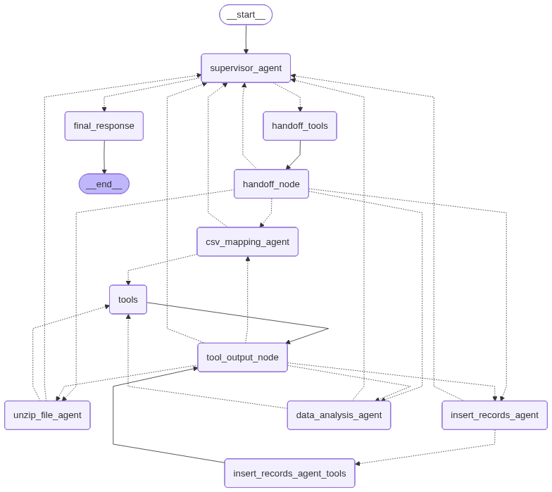

# projeto-final-2025-10-30

****

- [Introdução](#introdução)
- [Artefatos](#artefatos)
- [Como configurar a aplicação?](#como-configurar-a-aplicação)
- [Como executar a aplicação?](#como-executar-a-aplicação)
- [Licença](#licença)

## Introdução

Este aplicativo foi desenvolvido para ser uma ferramenta de classificação, análise e reporte de dados de NF-e em arquivos no formato CSV obtidas do [**Portal da Transparência**](https://portaldatransparencia.gov.br/download-de-dados/notas-fiscais).

Este aplicativo foi desenvolvido com a linguagem [**Python**](https://www.python.org/), os frameworks [**Streamlit**](https://streamlit.io/) e [**LangGraph**](https://www.langchain.com/langgraph) e o banco de dados
[**PostgreSQL**](https://www.postgresql.org/).

Ele utiliza um workflow provido de Agentes de IA especializados:

- Agente Supervisor: O Maestro do Fluxo responsável por receber a consulta inicial do usuário e decidir qual agente especializado deve assumir a tarefa.

- Agente de Descompactação de Arquivo ZIP: Descompacta arquivos ZIP que contém arquivos de NF-e em formato CSV.

- Agente de Mapeamento de CSVs: Mapeia dados das NF-e em arquivos CSV para argumentos de ingestão que serão inseridos em tabelas no banco de dados SQL.

- Agente de Inserção de Registros: Insere dados das NF-e obtidos do mapeamento dos argumentos de ingestão no banco de dados SQL.

- Agente de Análise de Dados: Analisa dados segundo diferentes atributos como por tipo (compra, venda, serviço) e por centros de custos, e além de gerar recursos gráficos e outras visualizações, tudo isso através de um simples bate-papo.



## Artefatos

Os artefatos do projeto (Relatório do Projeto, Apresentação em formato PPTX e Vídeo de apresentação para banca examinadora) estão armazenados no diretório **Projeto Final - Artefatos**.

## Como configurar a aplicação?

Antes de executar a aplicação localmente, é necessário instalar o [**Docker**](https://www.docker.com/) na máquina local.

Depois disso, obtenha uma chave de API OpenAI para a configuração dos Agentes de IA.

### Configurar o arquivo .env:

Renomeie o arquivo **.env.example** para **.env** e atribua valores para as chaves do arquivo conforme desejado.

Neste caso, apenas a variável relacionada a API KEY do LLM logo abaixo do comentário AI Settings é necessária. Todas as demais variáveis de ambiente podem ser mantidas sem qualquer alteração.

Por exemplo:

```
AI_LLM_API_KEY=
```

## Como executar a aplicação?

A aplicação pode ser executada usando comandos adicionados em um arquivo Makefile.

### Arquivo Makefile

Um arquivo **Makefile** foi criado como um único ponto de entrada contendo um conjunto de instruções para o desenvolvimento da aplicação.

Construção da Imagem do Contêiner do Banco de Dados

Navegue até a pasta da aplicação onde se encontra o arquivo Makefile e, ao mesmo tempo, o arquivo docker-compose.yml. Então, execute o comando de construção da imagem:

```
make startup-postgresql-container
```

Construção da Imagem do Contêiner da Aplicação

Também navegue até a pasta da aplicação onde se encontram os arquivos anteriores e execute o comando de construção da imagem:

```
make startup-streamlit-app-container
```

Perguntas gráficas:

Crie um gráfico de barras que mostre a contagem de faturas por estado (coluna emitter_uf).

Crie um histograma para visualizar a distribuição dos valores totais das faturas (coluna total_invoice_value).

    def __run_dummy_data_simulation(
        self, selected_year: int, tab_id: str
    ) -> Dict[str, List[Dict[str, Any]]]:
        raw_multi_year_data = [
            {
                "emitter_uf": "MG",
                "year": 2025,
                "total_value_sum": 12060.0,
                "num_invoices": 2,
                "avg_invoice_value": 6030.0,
                "item_count": 5,
                "item_total_value_sum": 12060.0,
                "total_quantity": 25,
            },
            {
                "emitter_uf": "GO",
                "year": 2025,
                "total_value_sum": 1050.0,
                "num_invoices": 2,
                "avg_invoice_value": 525.0,
                "item_count": 3,
                "item_total_value_sum": 1050.0,
                "total_quantity": 8,
            },
            {
                "emitter_uf": "SP",
                "year": 2025,
                "total_value_sum": 15000.0,
                "num_invoices": 1,
                "avg_invoice_value": 15000.0,
                "item_count": 2,
                "item_total_value_sum": 14950.0,
                "total_quantity": 100,
            },
            {
                "emitter_uf": "SP",
                "year": 2024,
                "total_value_sum": 17500.0,
                "num_invoices": 1,
                "avg_invoice_value": 17500.0,
                "item_count": 4,
                "item_total_value_sum": 17500.0,
                "total_quantity": 50,
            },
            {
                "emitter_uf": "BA",
                "year": 2024,
                "total_value_sum": 20000.0,
                "num_invoices": 1,
                "avg_invoice_value": 20000.0,
                "item_count": 1,
                "item_total_value_sum": 20000.0,
                "total_quantity": 200,
            },
            {
                "emitter_uf": "MG",
                "year": 2024,
                "total_value_sum": 30000.0,
                "num_invoices": 1,
                "avg_invoice_value": 30000.0,
                "item_count": 6,
                "item_total_value_sum": 29900.0,
                "total_quantity": 10,
            },
            {
                "emitter_uf": "MG",
                "year": 2023,
                "total_value_sum": 15000.0,
                "num_invoices": 1,
                "avg_invoice_value": 15000.0,
                "item_count": 3,
                "item_total_value_sum": 15000.0,
                "total_quantity": 15,
            },
            {
                "emitter_uf": "GO",
                "year": 2023,
                "total_value_sum": 3500.0,
                "num_invoices": 1,
                "avg_invoice_value": 3500.0,
                "item_count": 1,
                "item_total_value_sum": 3500.0,
                "total_quantity": 5,
            },
            {
                "emitter_uf": "SP",
                "year": 2022,
                "total_value_sum": 3000.0,
                "num_invoices": 1,
                "avg_invoice_value": 3000.0,
                "item_count": 2,
                "item_total_value_sum": 3000.0,
                "total_quantity": 5,
            },
        ]

        if tab_id == "MULTI_YEAR":
            return {
                "multi_year_data": [
                    d for d in raw_multi_year_data if d["year"] <= selected_year
                ]
            }

        if selected_year == 2025:
            uf_data_2025 = [
                {
                    "emitter_uf": "MG",
                    "total_value_sum": 12060.0,
                    "num_invoices": 2,
                    "avg_invoice_value": 6030.0,
                    "item_count": 5,
                    "item_total_value_sum": 12060.0,
                    "total_quantity": 25,
                },
                {
                    "emitter_uf": "GO",
                    "total_value_sum": 1050.0,
                    "num_invoices": 2,
                    "avg_invoice_value": 525.0,
                    "item_count": 3,
                    "item_total_value_sum": 1050.0,
                    "total_quantity": 8,
                },
                {
                    "emitter_uf": "SP",
                    "total_value_sum": 15000.0,
                    "num_invoices": 1,
                    "avg_invoice_value": 15000.0,
                    "item_count": 2,
                    "item_total_value_sum": 14950.0,
                    "total_quantity": 100,
                },
            ]

            product_data_2025 = [
                {
                    "product_service_description": "TAURUS PISTOLA G2C",
                    "item_total_value_sum": 12060.0,
                    "product_count": 50,
                },
                {
                    "product_service_description": "CIMENTO CP II",
                    "item_total_value_sum": 14950.0,
                    "product_count": 120,
                },
                {
                    "product_service_description": "QUEIJO MUSSARELA",
                    "item_total_value_sum": 1050.0,
                    "product_count": 30,
                },
            ]

            data_map_2025 = {
                "INVOICE_COUNT_UF": uf_data_2025,
                "INVOICE_ITEM_COUNT_UF": uf_data_2025,
                "INVOICE_ITEM_QUANTITY_UF": uf_data_2025,
                "INVOICE_ITEM_BY_PRODUCT": product_data_2025,
                "PRODUCT_COUNT": product_data_2025,
                "INVOICE_AVG_VALUE_UF": uf_data_2025,
                "INVOICE_TOTAL_VALUE_UF": uf_data_2025,
                "INVOICE_ITEM_TOTAL_VALUE_UF": uf_data_2025,
            }

            return {"data_list": data_map_2025.get(tab_id, [])}

        elif selected_year == 2024:
            uf_data_2024 = [
                {
                    "emitter_uf": "SP",
                    "total_value_sum": 17500.0,
                    "num_invoices": 1,
                    "avg_invoice_value": 17500.0,
                    "item_count": 4,
                    "item_total_value_sum": 17500.0,
                    "total_quantity": 50,
                },
                {
                    "emitter_uf": "BA",
                    "total_value_sum": 20000.0,
                    "num_invoices": 1,
                    "avg_invoice_value": 20000.0,
                    "item_count": 1,
                    "item_total_value_sum": 20000.0,
                    "total_quantity": 200,
                },
                {
                    "emitter_uf": "MG",
                    "total_value_sum": 30000.0,
                    "num_invoices": 1,
                    "avg_invoice_value": 30000.0,
                    "item_count": 6,
                    "item_total_value_sum": 29900.0,
                    "total_quantity": 10,
                },
            ]

            product_data_2024 = [
                {
                    "product_service_description": "CIMENTO CP II",
                    "item_total_value_sum": 17500.0,
                    "product_count": 100,
                },
                {
                    "product_service_description": "AREIA LAVADA",
                    "item_total_value_sum": 20000.0,
                    "product_count": 250,
                },
                {
                    "product_service_description": "NOTEBOOK CORE I7",
                    "item_total_value_sum": 29900.0,
                    "product_count": 15,
                },
            ]

            data_map_2024 = {
                "INVOICE_COUNT_UF": uf_data_2024,
                "INVOICE_ITEM_COUNT_UF": uf_data_2024,
                "INVOICE_ITEM_QUANTITY_UF": uf_data_2024,
                "INVOICE_ITEM_BY_PRODUCT": product_data_2024,
                "PRODUCT_COUNT": product_data_2024,
                "INVOICE_AVG_VALUE_UF": uf_data_2024,
                "INVOICE_TOTAL_VALUE_UF": uf_data_2024,
                "INVOICE_ITEM_TOTAL_VALUE_UF": uf_data_2024,
            }

            return {"data_list": data_map_2024.get(tab_id, [])}

        return {"data_list": []}

**CRITICAL MANDATORY SCHEMA CHECK & DATE COLUMN RESOLUTION:** - **ABSOLUTELY CRITICAL:** If the task involves any date/time column (e.g., filtering by YEAR, MONTH, DATE), your **FIRST ACTION MUST BE** to call the **get_detailed_table_schemas_tool** for the `invoice` table. - The `get_detailed_table_schemas_tool` returns column **descriptions (comments)** which are CRITICAL for identifying the correct date column (e.g., 'issue_date', 'emission_datetime', 'created_at', etc.). - **DO NOT GUESS COLUMN NAMES.** Use the column comment returned by the schema tool to find the correct date column for filtering. - If the schema check confirms the date column is, for instance, `issue_date` (and NOT `emission_date`), you MUST use `issue_date` in your SQL.

        **SQL EXECUTION FLOW:**
        1. **Schema Check** (If necessary, as defined above).
        2. **SQL Generation:** Construct the correct SQL query using the confirmed date column.
        3. **Execution:** Call `async_query_sql_database_tool` to get the raw data.
        4. **Final JSON:** Format the output strictly as a JSON object as requested by the user's instructions.

        CRITICAL RULES:
        - NEVER invent table or column names.
        - After a schema check, DO NOT call the schema tool again unless the query target changes.
        - If your final response must be the requested JSON data, with no surrounding text or explanation.
        - **NEVER** respond to the supervisor immediately upon receiving a task without trying to execute it, with or without the help of a tool.
